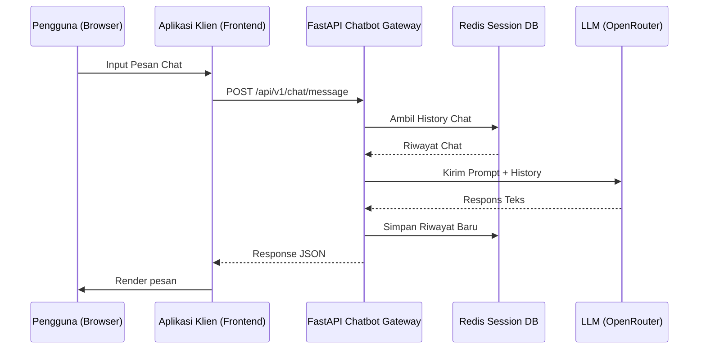

# Panduan Integrasi Klien - AI Assistant Gateway / Local LLM

Dokumen ini menjelaskan cara mengintegrasikan client platform (**Web Portofolio**, **Web CuacaKita**, dan **Audio Stream (Syncra)**) dengan **Centralized AI Chatbot Gateway** atau **Local LLM langsung**.

---

## Opsi A: Centralized AI Chatbot Gateway (Lama)



```env
REACT_APP_CHATBOT_GATEWAY_URL=https://api.raflylabs.com/api/ai/v1/chat/message
```

## Opsi B: Local LLM Langsung (Baru)

Memanggil OpenAI-compatible API local LLM (`unsloth/gemma-3-1b-it-GGUF:Q4_0`) tanpa gateway.

```env
REACT_APP_CHATBOT_GATEWAY_URL=https://api.raflylabs.com/api/ailocal/v1/chat/completions
```

### Format Request

```json
{
  "model": "unsloth/gemma-3-1b-it-GGUF:Q4_0",
  "messages": [
    { "role": "system", "content": "System prompt..." },
    { "role": "user", "content": "Pesan pengguna" }
  ],
  "stream": false,
  "temperature": 0.8,
  "max_tokens": 1024
}
```

### Format Response

```json
{
  "choices": [
    { "message": { "role": "assistant", "content": "Jawaban AI" } }
  ]
}
```

### Contoh Implementasi

```javascript
const LOCAL_LLM_URL = "https://api.raflylabs.com/api/ailocal/v1/chat/completions";
const LOCAL_MODEL = "unsloth/gemma-3-1b-it-GGUF:Q4_0";

async function sendToLocalLLM(messageText, historyMessages = []) {
  try {
    const response = await fetch(LOCAL_LLM_URL, {
      method: "POST",
      headers: { "Content-Type": "application/json" },
      body: JSON.stringify({
        model: LOCAL_MODEL,
        messages: [
          { role: "system", content: "Anda adalah asisten AI portofolio Rafly." },
          ...historyMessages.slice(-10),
          { role: "user", content: messageText }
        ],
        stream: false,
        temperature: 0.8,
        max_tokens: 1024
      }),
    });

    if (!response.ok) throw new Error(`HTTP error! Status: ${response.status}`);

    const data = await response.json();
    return {
      success: true,
      content: data.choices?.[0]?.message?.content || ""
    };
  } catch (error) {
    console.error("Gagal terhubung ke Local LLM:", error);
    return { success: false, error: "Gagal terhubung ke asisten AI." };
  }
}
```

---

## 🎨 3. Penerapan Spesifik per Platform

### A. Website Portofolio (`web_porto` / `raflylabs.com`)
* **Tujuan**: Menjawab pertanyaan pengunjung tentang skill, proyek, dan pengalaman kerja Rafly.
* **Tipe Integrasi**: Widget Chat (Floating Chatbot Bubble) di pojok kanan bawah.
* **Penanganan Respons**:
  - Tampilkan `content` berupa teks respons dari AI.
  - Karena bertipe tanya-jawab umum, respons biasanya memiliki `"response_type": "text"`.

### B. Website Cuaca (`web_cuacakita`)
* **Tujuan**: Membantu pengguna memproses pertanyaan seputar ramalan cuaca melalui interaksi natural (NLP).
* **Tipe Integrasi**: Kolom pencarian bertenaga AI atau Chatbox Asisten Cuaca.
* **Penanganan Respons**:
  - Menampilkan deskripsi prakiraan cuaca yang dikembalikan oleh AI di UI Chat.

### C. Platform Audio Stream (`audio_stream` / `Syncra`)
* **Tujuan**: Memungkinkan kendali pemutar musik lewat perintah chat teks / suara (misal: "Putar lagu lofi").
* **Tipe Integrasi**: Chatbox asisten pemutar musik.
* **Penanganan Respons**:
  - Selain menampilkan pesan teks `content`, aplikasi **wajib** mendengarkan field `action_triggered`.
  - Jika `response_type` bernilai `"action"` dan `action_triggered` tidak kosong, jalankan fungsi pemutar musik di frontend.

#### Kode Contoh Integrasi Player di Audio Stream:
```javascript
async function handleAudioChat(userInput) {
  const result = await sendMessageToGateway(userInput, "audio_stream");

  if (!result.success) {
    addMessageToUI("system", result.error);
    return;
  }

  const { content, response_type, action_triggered } = result.data;
  
  // 1. Tampilkan pesan teks dari AI ke UI Chat
  addMessageToUI("assistant", content);

  // 2. Jika ada perintah pemutar musik yang dipicu oleh AI
  if (response_type === "action" && action_triggered) {
    const { target_service, command, parameters } = action_triggered;

    if (target_service === "audio_stream") {
      executeMusicCommand(command, parameters);
    }
  }
}

// Fungsi pengontrol pemutar musik asli di frontend Audio Stream
function executeMusicCommand(command, parameters) {
  console.log(`Menjalankan perintah musik: ${command} dengan parameter:`, parameters);
  
  switch (command) {
    case "PLAY_TRACK":
      // Contoh logika integrasi dengan audio player (HTML5 Audio / Spotify SDK / Custom Player)
      if (parameters.genre === "lo-fi") {
        playMusicGenre("lo-fi", parameters.track_id);
      } else {
        playMusicGenre(parameters.genre || "general");
      }
      break;
    case "STOP":
      pauseMusic();
      break;
    case "PAUSE":
      pauseMusic();
      break;
    case "NEXT":
      nextTrack();
      break;
    case "PREV":
      previousTrack();
      break;
    default:
      console.warn("Perintah tidak dikenal oleh player:", command);
  }
}
```

---

## ⚠️ Penanganan Error & Best Practices

1. **Rate Limiting (HTTP 429)**
   - Jika pengguna mengirim pesan terlalu cepat (lebih dari 10 kali/menit), gateway akan membalas dengan status HTTP 429.
   - Frontend harus menangkap status ini dan menampilkan notifikasi ramah pengguna: *"Eits, lambatkan pesanmu! Silakan tunggu beberapa saat."*

2. **Fallback Sesi Offline / Server Down**
   - Pastikan widget chat atau asisten AI di frontend tidak memblokir fungsionalitas utama web jika Gateway Chatbot mati. Gunakan blok `try-catch` di tingkat terluar pemanggilan API.

3. **Indikator Loading (Typing Indicator)**
   - Panggilan ke LLM memerlukan waktu sekitar 1 s.d. 3 detik. Pastikan menampilkan animasi ketikan/loading (*typing indicator*) di UI chat agar memberikan pengalaman pengguna yang responsif (*interactive UX*).
